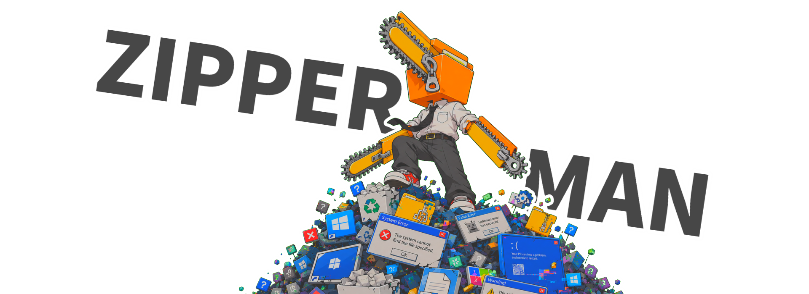
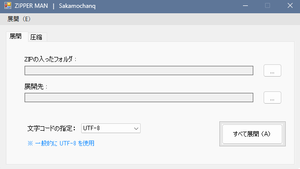
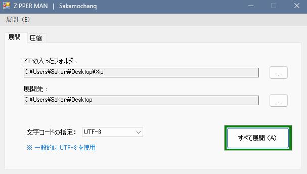

<div align="center">
    
</div>

<br>
<br>
<hr>
<br>
<br>

<div align="center">
    <h3> チェンソーマン 好き。</h3>
    <p>ZIPPER-MANとは、複数のZIPファイルを一括で展開するためのアプリケーションです。</p>
</div>

<br>

<h3>技術スタック</h3>

<div>
  <table>
    <thead>
      <tr>
        <th>項目</th>
        <th>技術</th>
      </tr>
    </thead>
    <tbody>
      <tr>
        <td>開発言語</td>
        <td>C#</td>
      </tr>
      <tr>
        <td>フレームワーク</td>
        <td>.NET Framework</td>
      </tr>
      <tr>
        <td>ソフトウェア</td>
        <td>Visual Studio 2022</td>
      </tr>
      <tr>
        <td>その他のツール</td>
        <td>git / NuGet</td>
      </tr>
    </tbody>
  </table>
</div>

<br>
<br>

<h3>環境構築</h3>

1. リポジトリのクローン  

    ```bash
    git clone https://github.com/Sakamochanq/Zipper-Man.git
    cd Zipper-Man/src
    ```

<br>

2. プロジェクトを開く  

    `Zipper-Man.sln` をVisual Studioで開きます。

<br>

3. ビルド

    Visual Studioのビルド機能を使用してプロジェクトをビルドします。

<br>
<br>

<h3>使い方</h3>

1. ZIPファイルの選択  

    アプリケーションを起動し、展開したいZIPファイルを選択します。

<br>

2. 展開先の指定

    展開先のフォルダを指定します。

<br>

3. 文字コードの選択

    ZIPファイル内のファイル名の文字コードを選択します。通常は「Shift_JIS」を選択しますが、必要に応じて他の文字コードを選択してください。

<br>

4. 展開の開始

    「すべて展開」ボタンをクリックすると、ZIPファイルの展開を開始します。

<br>

<div>
  <table>
    <thead>
      <tr>
        <th>Fig1. 起動画面</th>
        <th>Fig2. 実行中</th>
      </tr>
    </thead>
    <tbody>
      <tr>
        <td>
          
        </td>
        <td>
          
        </td>
      </tr>
    </tbody>
  </table>
</div>

<br>
<br>

<h3>バナー画像について</h3>

バナー画像は`ChatGPT for Create Image`により生成されました。なお、パロディ元であるチェンソーマンの画像は学習に使用していないことをここに明記します。生成された画像は、チェンソーマンのイメージを参考にしつつも、オリジナルのデザインとなっています。パロディ元の画像は [アニメーションスタジオ 株式会社MAPPA](https://www.mappa.co.jp/) の著作物であり、当プロジェクトとは一切関係ありません。

<br>

<div>
  <table>
    <thead>
      <tr>
        <th>Fig3. ZIPPER MAN</th>
        <th>Fig4. CHAINSAW MAN</th>
      </tr>
    </thead>
    <tbody>
      <tr>
        <td>
          
        </td>
        <td>
          
        </td>
      </tr>
    </tbody>
  </table>
</div>

<br>
<br>

<h3>License</h3>

Release under the [MIT](./LICENSE) License.

<br>
<br>

<h3>著者</h3>

Sakamochanq

<br>
<br>